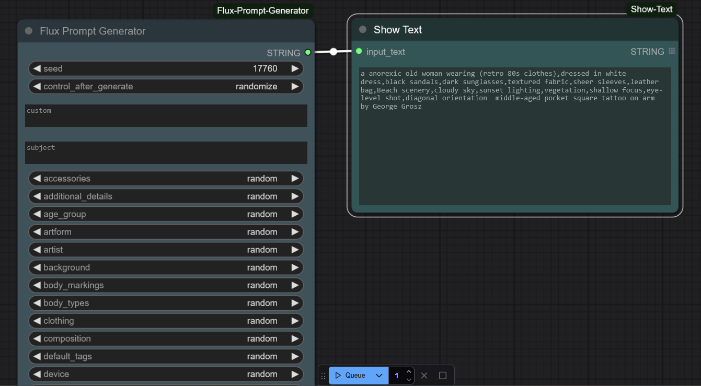

# ComfyUI-Show-Text

A simple but powerful node for ComfyUI that displays text input in a readable format. Perfect for viewing outputs from text generation nodes, prompt builders, interrogators, and more.



## Features

- Displays text input in a clean, readable format
- Supports multiline text
- Auto-resizes to fit content
- Updates in real-time as text changes
- Maintains text state in saved workflows
- Supports batch processing with list inputs

## Installation

1. Clone this repository into your `ComfyUI/custom_nodes` directory:

```bash
cd ComfyUI/custom_nodes
git clone https://github.com/fairy-root/ComfyUI-Show-Text.git
```

2. Restart ComfyUI

The node will now appear in the node menu under the "utils" category as "Show Text".

## Usage

1. Add the "Show Text" node to your workflow
2. Connect any text output to the node's input
3. The text will be displayed in a readable format within the node

The node will automatically update whenever the input text changes.

## Example Workflow

You can use Show Text with:

- Text generation nodes
- Prompt builders
- CLIP interrogators
- Any node that outputs text

## Donation

Your support is appreciated:

- USDt (TRC20): `TGCVbSSJbwL5nyXqMuKY839LJ5q5ygn2uS`
- BTC: `13GS1ixn2uQAmFQkte6qA5p1MQtMXre6MT`
- ETH (ERC20): `0xdbc7a7dafbb333773a5866ccf7a74da15ee654cc`
- LTC: `Ldb6SDxUMEdYQQfRhSA3zi4dCUtfUdsPou`

## Author and Contact

- GitHub: [FairyRoot](https://github.com/fairy-root)
- Telegram: [@FairyRoot](https://t.me/FairyRoot)

## License

This project is licensed under the MIT License. See the [LICENSE](LICENSE) file for details.

## Contributing

Contributions are welcome! Please open an issue or submit a pull request for any improvements or features.
